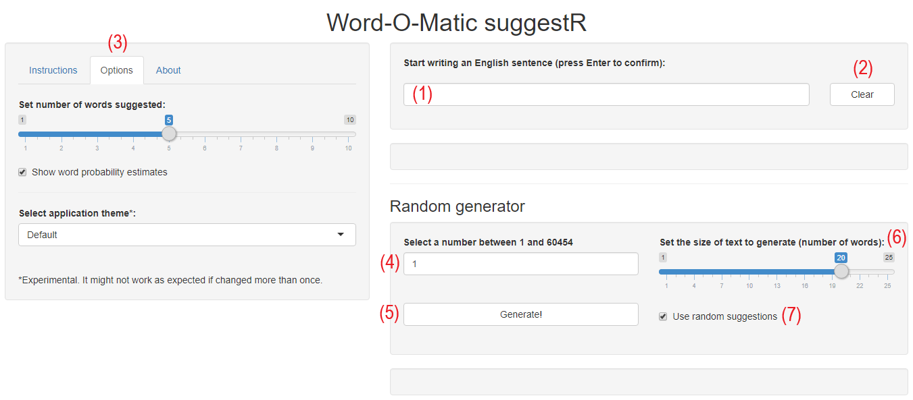
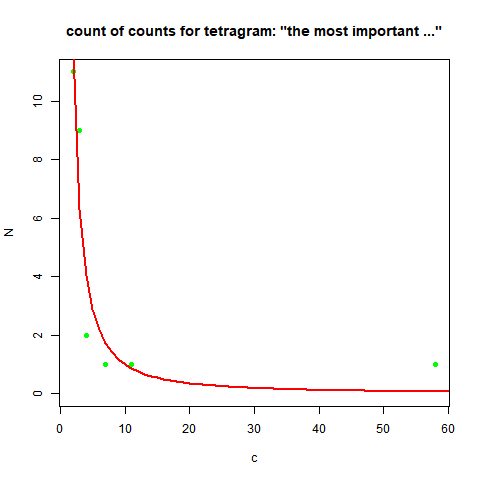

--- &twocol

## Instructions

<span style=font-size:smaller>
<em>Word-O-Matic</em> SuggestR is a Shiny application developed as part of the Coursera Data Science Specialization Capstone Project. It tries to predict which word comes next based on the last three words of an English sentence written by the user. Additionally, it includes a random text generator.</span>

*** =left

<span style=font-size:smaller><strong>Main Application:</strong> To confirm the input in the text box (1) press the <strong>Enter</strong> key. To clear the box click on the <strong>Clear</strong> button (2). Click on the <strong>Options</strong> tab (3) to change some presentation settings. Options include number of word suggestions, show/hide probability estimates and the application theme.
<strong>Random Generator:</strong> Select a seed number in the numeric input box (4) and click on the <strong>Generate!</strong> button (5). The slider (6) controls the number of words generated. By default, the next word is always randomly selected from the 10 words with highest probability. Uncheck the option (7) to always use the most likely word.</span>

*** =right

<div align=center>
</img>
</div>

--- 

## How it works?

The application is based on a 4-gram model built with 10% of randomly selected text lines extracted from the given text corpus. 

For details of the pre-processing steps taken to build the model see this <a href=https://rpubs.com/lsandino/milestone>report</a>.

Singletons were removed from the n-gram tables to reduce the model size. The following table summarizes the obtained model:

```{r include = FALSE}
library(dplyr)
library(tidyr)
library(knitr)
library(kableExtra)
```
```{r results = 'asis', echo = FALSE, message = FALSE}
info1 <- file.info("data/unigrams.RData")
info2 <- file.info("data/bigrams.RData")
info3 <- file.info("data/trigrams.RData")
info4 <- file.info("data/tetragrams.RData")
load("data/unigrams.RData")
load("data/bigrams.RData")
load("data/trigrams.RData")
load("data/tetragrams.RData")
df1 <- transmute(info1, Table = "unigrams", Length = nrow(unigrams), `File Size (MB)` = round(size/1024^2,2))
df2 <- transmute(info2, Table = "bigrams", Length = nrow(bigrams), `File Size (MB)` = round(size/1024^2,2))
df3 <- transmute(info3, Table = "trigrams", Length = nrow(trigrams), `File Size (MB)` = round(size/1024^2,2))
df4 <- transmute(info4, Table = "tetragrams", Length = nrow(tetragrams), `File Size (MB)` = round(size/1024^2,2))
df <- bind_rows(df1,df2,df3,df4)
kable(df) %>%
    kable_styling(bootstrap_options = c("striped", "hover", "condensed"), full_width = F)
```

---

## How it works?

The next word probabilities are estimated with the Katz Back-Off algorithm with smoothing starting the search in the 4-gram table and going back to the unigrams:

$$\scriptsize
\begin{align*}
P_{BO}\left(w_{i}|w_{i-1},w_{i-2},w_{i-3}\right) & =\begin{cases}
\frac{Count^{*}\left(w_{i-3},w_{i-2},w_{i-1},w_{i}\right)}{\underset{i}{\sum}Count^{*}\left(w_{i-3},w_{i-2},w_{i-1},w_{i}\right)} & w_{i}\in A=\left\{ w:Count\left(w_{i-3},w_{i-2},w_{i-1},w\right)>0\right\} \\
\alpha_{3}P_{BO}\left(w_{i}|w_{i-1},w_{i-2}\right) & w_{i}\notin A
\end{cases}\\
P_{BO}\left(w_{i}|w_{i-1},w_{i-2}\right) & =\begin{cases}
\frac{Count^{*}\left(w_{i-2},w_{i-1},w_{i}\right)}{\underset{i}{\sum}Count^{*}\left(w_{i-2},w_{i-1},w_{i}\right)} & w_{i}\in B=\left\{ w:Count\left(w_{i-2},w_{i-1},w\right)>0\right\} \backslash A\\
\alpha_{2}P_{BO}\left(w_{i}|w_{i-1}\right) & w_{i}\notin B
\end{cases}\\
P_{BO}\left(w_{i}|w_{i-1}\right) & =\begin{cases}
\frac{Count^{*}\left(w_{i-1},w_{i}\right)}{\underset{i}{\sum}Count^{*}\left(w_{i-1},w_{i}\right)} & w_{i}\in C=\left\{ w:Count\left(w_{i-1},w\right)>0\right\} \backslash B\\
\alpha_{1}P_{BO}\left(w_{i}\right) & w_{i}\notin C
\end{cases}\\
P_{BO}\left(w_{i}\right) & =\begin{array}{cc}
\frac{Count^{*}\left(w_{i}\right)}{\underset{i}{\sum}Count^{*}\left(w_{i}\right)} & w_{i}\in D=\left\{ w:Count\left(w\right)>0\right\} \backslash C\end{array}
\end{align*}
$$

$$\tiny
\alpha_{3}=1-\underset{A}{\sum}\left(\frac{Count^{*}\left(w_{i-3},w_{i-2},w_{i-1},w_{i}\right)}{\underset{i}{\sum}Count^{*}\left(w_{i-3},w_{i-2},w_{i-1},w_{i}\right)}\right)\quad\alpha_{2}=1-\underset{B}{\sum}\left(\frac{Count^{*}\left(w_{i-2},w_{i-1},w_{i}\right)}{\underset{i}{\sum}Count^{*}\left(w_{i-2},w_{i-1},w_{i}\right)}\right)\quad\alpha_{1}=1-\underset{C}{\sum}\left(\frac{Count^{*}\left(w_{i-1},w_{i}\right)}{\underset{i}{\sum}Count^{*}\left(w_{i-1},w_{i}\right)}\right)
$$

--- &twocol

## How it works?

Smoothing is implemented using two types of discounting:

*** =left

- When there are more than five $\scriptsize{\left(Count-N_{Count}\right)}$ data points (where $\scriptsize{N_{Count}}$ is the number of times that $\scriptsize{Count}$ has been seen), a power law is fitted using the non-linear least squares Levenberg-Marquardt algorithm (see picture for example), and the Good-Turing formula for revised counts is used: $\scriptsize{Count^{*}=\left(Count+1\right)\frac{N_{Count+1}}{N_{Count}}}$
- Absolute discounting is used otherwise, i.e. $\scriptsize{Count^{*}=Count-0.75}$

*** =right

<div align=center>
</img>
</div>

---

## Model Accuracy

In order to calculate the model accuracy, 100 random text lines were extracted of each text file of the corpus. For each line read, four consecutive words were randomly selected. After discarding observations with NA values, the first three words were used as input for the Katz Back-Off algorithm. Then, the suggested word with highest probability was compared to the fourth word. The following table summarizes the results: 

```{r echo = FALSE, message = FALSE}
load("data/test.RData")
load("data/testr.RData")
g1 <- sum(test1==df1$word4)
g2 <- sum(test2==df2$word4)
g3 <- sum(test3==df3$word4)
r1 <- round(100*g1/nrow(df1), 2)
r2 <- round(100*g2/nrow(df2), 2)
r3 <- round(100*g3/nrow(df3), 2)
df <- data_frame(`Text File` = c("News", "Blogs", "Twitter"), `Number of random tests` = c(nrow(df1),nrow(df2),nrow(df3)), `Right guesses` = c(g1, g2, g3), `Success (%)` = c(r1, r2, r3))
kable(df) %>%
    kable_styling(bootstrap_options = c("striped", "hover", "condensed"), full_width = F)
```


